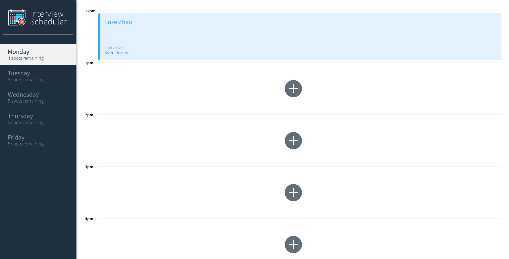
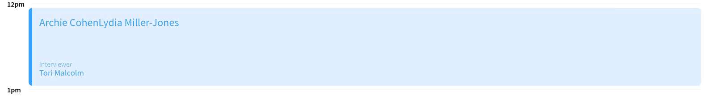

# Interview Scheduler

## Setup

Install dependencies with `npm install`.

[Click to see it live!](https://scheduler-ez.netlify.app/)
Please wait for a few seconds for the app to complete connecting to database

## Running Webpack Development Server

```sh
npm start
```

## Running Jest Test Framework

```sh
npm test
```

## Running Storybook Visual Testbed

```sh
npm run storybook
```

## Main page:



## Demos

Book, Edit and Delete Appointments

Error Notification when deleting or Saving Appointments

