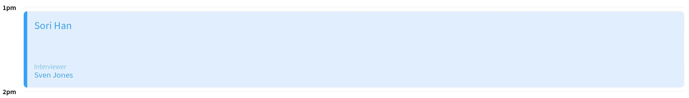
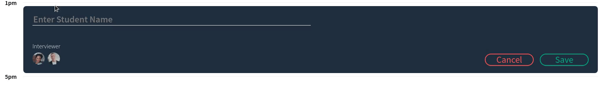

# Interview Scheduler

## Setup

Install dependencies with `npm install`.

[Click to see it live!](https://scheduler-ez.netlify.app/)

## Running Webpack Development Server

```sh
npm start
```

## Running Jest Test Framework

```sh
npm test
```

## Running Storybook Visual Testbed

```sh
npm run storybook
```

## Main page:


## Demos

Book Appointment

Edit Appointment

Delete Appointment

Error Msg when deleting

Error Msg when saving

